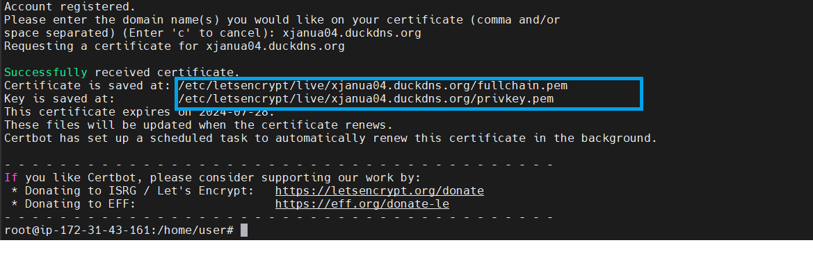
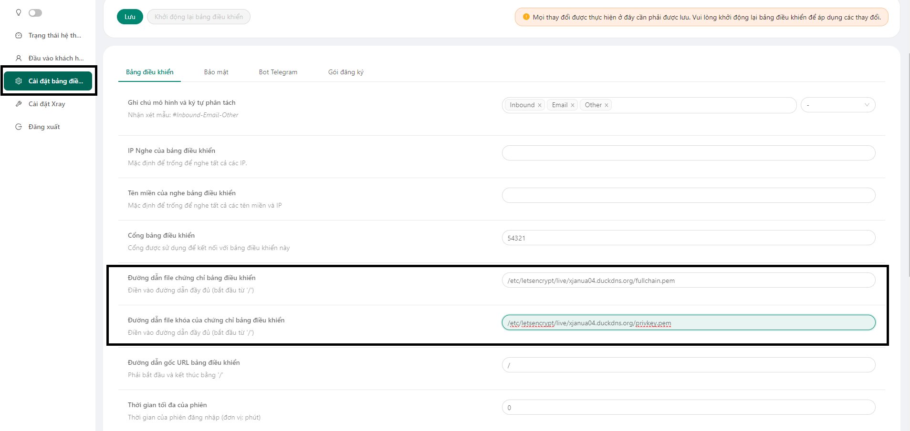
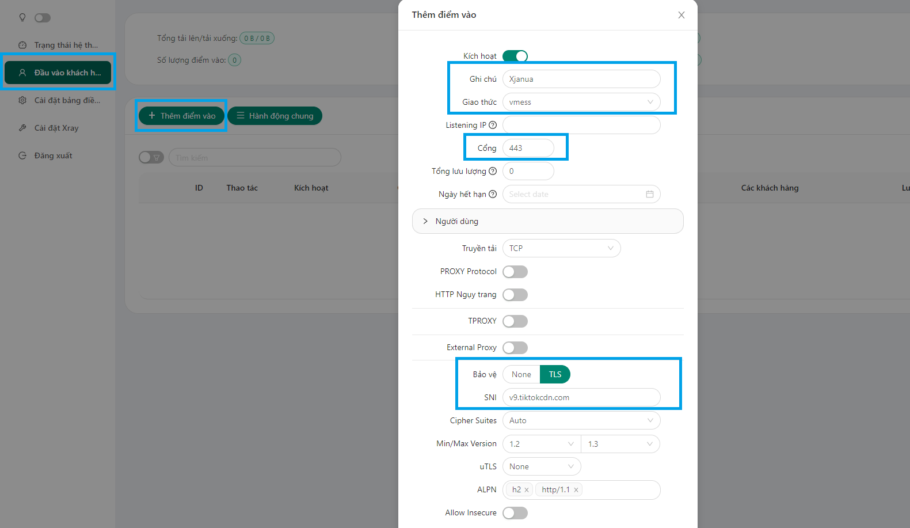
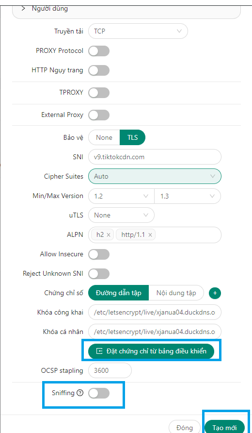

# 3x-ui
Lần lượt chạy các lệnh sau theo mình
# Cài đặt 3x-ui
sudo su

Nhập pass vps

apt update -y

apt upgrade
## Install & Upgrade

```
bash <(curl -Ls https://raw.githubusercontent.com/mhsanaei/3x-ui/master/install.sh)
```

## Install Custom Version

To install your desired version, add the version to the end of the installation command. e.g., ver `v2.3.4`:

```
bash <(curl -Ls https://raw.githubusercontent.com/mhsanaei/3x-ui/master/install.sh) v2.3.4
```
y

admin

admin

54321 (Cổng này ae có thể thay đổi tuỳ thích. Nhưng khuyên cứ làm theo mình)
# Open port
ufw allow 80

ufw allow 443

ufw allow 22
# Tạo domain
Truy cập https://www.duckdns.org/ đăng nhập gmail và tạo cho mình 1 domain miễn phí và trỏ ip về con vps của mình.

Cách trỏ domain về vps thì mng coppy cái IP của VPS dán vào Current ip rồi ấn update là được.

Định dạng truy cập web là: domain:54321 -> Ví dụ xjanua04.duckdns.org:54321

User và pass mặc định là: admin

User và pass mặc định là: admin.
# Tạo chứng chỉ SSL
Quay về Terminal nhập tiếp các lệnh sau đây

apt-get install certbot -y

certbot certonly

-Chọn 1: Standalone

-Điền mail của mình là được

-Sau đó các bạn gõ A để đồng ý điều khoản dịch vụ

-Chọn N để không chia sẻ email

-Nhập Domain lúc nãy lấy ở DuckDNS về

Sau khi nhập domain vô thì họ sẽ gửi cho ta chìa để kích hoạt HTTPS và sao chép lại nha.

Truy cập vào bảng điều khiển dán 2 cái key lúc nãy vô lưu và khởi động lại bảng điều khiển.

Bảng điều khiển của mình đã có chứng chỉ HTTPS.

# Bây giờ đến tạo file 4G.
Lưu ý: Chỉ làm theo những dòng khoanh ô màu xanh của mình.

"Ghi chú" là tên file mạng có thể đặt theo tuỳ sở thích của ae.




Như vậy thì chúng ta đã hoàn thiện tạo thành cồng QR để hack 4G. Giờ thì đến hướng dẫn sử dụng.
